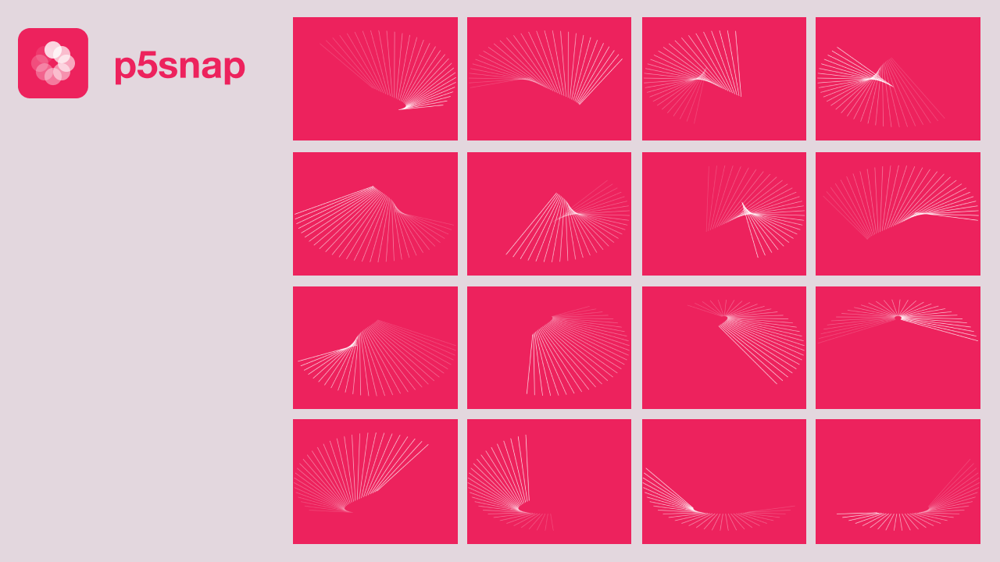

<br/><br/>
 <a href="https://github.com/zachkrall/p5snap/issues/"></a> <a href="https://npmjs.com/package/p5snap/"></a>
<a href="https://github.com/zachkrall/p5snap/graphs/contributors"></a> <a href="http://newschool.edu"></a>

## about

**p5snap** is a command-line interface that creates and saves snapshots of a p5 sketch

## installation

with `npm`:

```shell
npm -g install p5snap
```

## usage

to start p5snap, provide a relative file path and the number of images that should be saved

```shell
p5snap <FILE-PATH> -n <NUMBER-OF-IMAGES>
```

for example:

```shell
p5snap ./mySketch.js -n 20
```

will create:<br/>
• mySketch_0.png<br/>
• mySketch_1.png<br/>
• mySketch_2.png<br/>
• ...<br/>
• mySketch_19.png

### as a module

you can bring p5snap into your existing node.js build tools by importing the snap module.

snap() only executes once, you can implement your own setInterval() to run snap() multiple times

for example:

```javascript
const path = require('path')
const snap = require('p5snap/lib/snap.js')

snap({
  sketch_path: path.resolve(__dirname, './mySketch.js'),
  output_path: path.resolve(__dirname, 'output'),
  width: 1920,
  height: 1080,
  instance: false,
  filename: 'mySketch' // milliseconds to delay capturing
})
```

### instance mode

if your sketch is written as a p5 instance, you can use the `--instance` flag to execute **p5snap** in instance mode

`module.exports` and `require` statements are removed from instance mode. sketch should also include a "new p5()" call.

[view example code](./examples/instance.js) for instance mode sketches.

## limitations

### single canvas

**p5snap** currently only saves a single `<canvas/>` context. If your p5 drawing uses or draws DOM elements, it will not be included in the image.

### interactive sketches

**p5snap** runs in a hidden virtual browser environment. this means that interactive elements like webcam footage, cursor events, or key presses won't be triggered.

### external resources

right now, the virtual browser environment does not have access to loading any external resources. a work around is providing them in your javascript as a data uri.

eventually, I'd like to include the JSOM fromFile api to allow passing in an index.html file instead of a js file.

## contributing

Contributions, issues and feature requests are welcome.<br/>Feel free to check [issues](https://github.com/zachkrall/p5snap/issues/) page if you want to contribute.

Check the <a href="https://github.com/zachkrall/p5snap/issues?q=is%3Aissue+is%3Aopen+label%3A%22help+wanted%22"></a> tag for suggestions on features to work on.

## license

Copyright © 2020 [Zach Krall](https://zachkrall.com).<br/>This project is [MIT](https://github.com/zachkrall/p5snap/blob/master/LICENSE) licensed.
